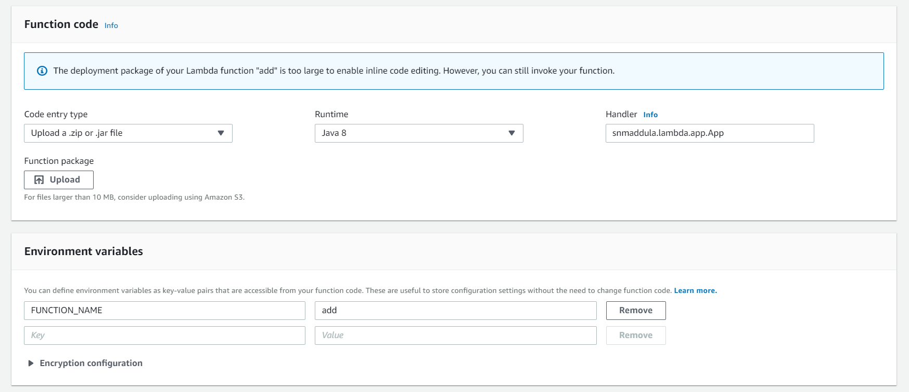
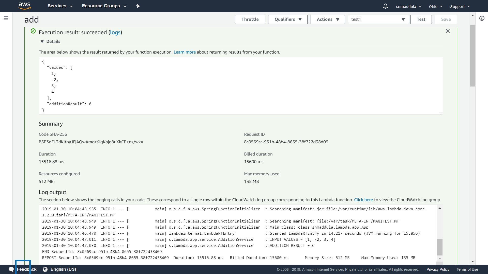

# Spring Cloud AWS Lambda Template
AWS Lambda Function bootstrapped with Spring Boot + Spring Cloud runtime.

##### Package App
    mvn clean package
    
##### Invoke the App
	java -jar target/lambda-template-1.0-aws.jar

##### Invoke Endpoint : add
    curl -H "Content-Type: application/json" localhost:9090/add -d '{ "values": [1,-2,3,4] }'

##### Response:
	{
		"values": [1,-2,3,4],
		"additionResult": 6
	}

##### Lambda Function [ "add" ] Configuration:

##### Lambda Function [ "add" ] Execution Status / Result:

	
	